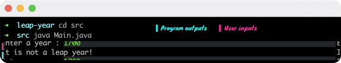

#  Leap Year
## Checks whether the year the user entered is a leap year
> A leap year (also known as an intercalary year or bissextile year) is a calendar year that contains an additional day (or, in the case of a lunisolar calendar, a month) added to keep the calendar year synchronized with the astronomical year or seasonal year.[1] Because astronomical events and seasons do not repeat in a whole number of days, calendars that have a constant number of days in each year will unavoidably drift over time with respect to the event that the year is supposed to track, such as seasons. By inserting (called intercalating in technical terminology) an additional day or month into some years, the drift between a civilization's dating system and the physical properties of the Solar System can be corrected. A year that is not a leap year is a common year.
[Wikipedia](https://en.wikipedia.org/wiki/Leap_year)


[@See](https://www.ctvnews.ca/mobile/sci-tech/leap-year-explained-why-february-has-an-extra-day-in-2020-1.4831687?cache=walqrkeg)
### An example


### Requirements:
* JDK (version 17 is recommended)

### To run:
Open the terminal on the project directory and type:

```
$ cd src
$ java Main.java
```
## Author

👤 **Furkan Denizhan**

- GitHub: [nevisende](https://github.com/nevisende)
- Twitter: [@nevisen_de](https://twitter.com/nevisen_de)
- LinkedIn: [furkan-denizhan](https://www.linkedin.com/in/furkan-denizhan/)

## 🤝 Contributing

Contributions, issues, and feature requests are welcome!

Feel free to check the [issues page](../../issues/).

## Show your support

Give a ⭐️ if you like this project!

## Acknowledgments

- This repo is created for  www.patika.dev and ebebek Java & QA & SAP Spartacus Practicum.
